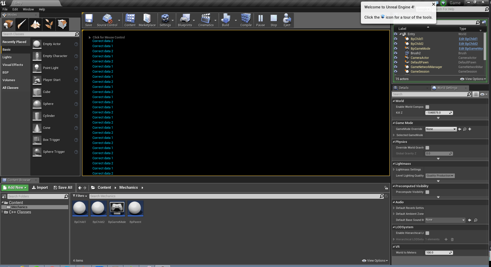
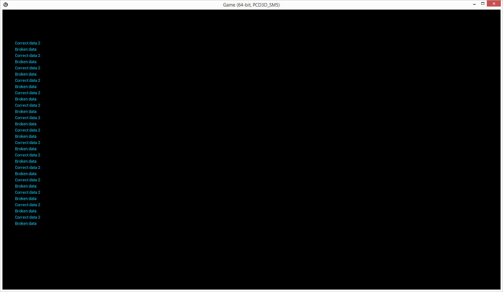

# UE 4.10 Bug

## Problem

Incorrect asset loading in Cooked game data. Same asset in PIE works correctly.

## This project content

After some investigation, I minimize problem in this project.

This project contains:

 * Config/DefaultEngine.ini - redefine GlobalDefaultGameMode to BpGameMode;
 * Content/Mechanics/BpGameMode.uasset - simply create BpChild1 and BpChild2 instances and print Node->Leaf->Message of this objects every tick;
 * Content/Mechanics/BpParent.uasset (W1.W1Entry) - base object with "Broken data" string in Node->Leaf->Message property;
 * Content/Mechanics/BpChild1.uasset (BpParent) - object with long history with "Correct data 1" string in Node->Leaf->Message property;
 * Content/Mechanics/BpChild2.uasset (BpParent) - object created from scratch with "Correct data 2" string in Node->Leaf->Message property.

BpChild1 and BpChild2 is same in Editor (except number in Node->Leaf->Message property). I don't known how differ BpChild1 and BpChild2 in internal content and why its have differ behaviour after cooking.

Looks like asset recreation from scratch solving our problem, but:

 * Why this asset is broken;
 * We don't known, how we can find all broken assets;
 * Originally this asset is mutch bigger and manual asset recreation is not so simple.

## Steps to reproduce problem

 * Open project Game.uproject and cook it
 * Run cooked game
 
**Expected result**:

Many messages "Correct data 1" and "Correct data 2" (like in PIE).

**Actual result**:

Many messages "Broken data" and "Correct data 2".

